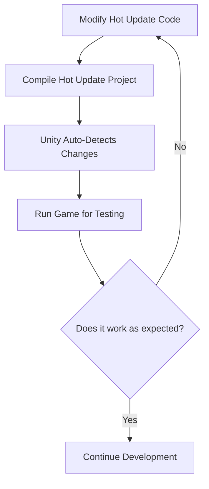

# Quick Start

This guide will help you get started with JEngine v1.0 for developing hot-updatable Unity games.

[[toc]]

## System Requirements

### Unity Version Requirements
- **Unity Version**: 2021.3 LTS or higher (2022.3 LTS recommended)
- **API Compatibility Level**: .NET Framework / .NET Standard 2.1

### Development Environment
- **.NET Version**: .NET Framework 4.7.1+ or .NET 6.0+
- **Operating System**: Windows 10/11, macOS 10.15+, Ubuntu 18.04+
- **IDE Recommendation**: Visual Studio 2022, JetBrains Rider, or Visual Studio Code

## Project Setup

### 1. Enable Unsafe Code
In Unity PlayerSettings, find `Allow Unsafe Code` and enable it (check the box).

### 2. Configure .NET Version
In Unity PlayerSettings:
- Set `API Compatibility Level` to `.NET Framework` or `.NET Standard 2.1`
- Ensure you're not using `.NET Standard 2.0`

## Project Structure

JEngine v1.0 uses an optimized directory structure:

### Unity Project Structure
```
Assets/
├── Dependencies/           # Core modules
│   ├── ILRuntime/         # ILRuntime module
│   ├── YooAsset/          # Asset management module
│   └── JEngine.Core/      # JEngine core
├── HotUpdateResources/    # Hot update resources
│   ├── Main/              # Main package resources
│   │   ├── Common/        # Common resources
│   │   ├── Scenes/        # Scene resources
│   │   ├── Scripts/       # Hot update script DLLs
│   │   └── Shaders/       # Shader resources
│   └── DLC/               # DLC packages (optional)
├── Scripts/               # Local scripts
│   ├── Helpers/           # Helper classes
│   ├── Adapters/          # ILRuntime adapters
│   └── Examples/          # Example code
└── Scenes/
    └── Init.unity         # Launch scene
```

### Hot Update Code Structure
```
HotUpdateScripts/
├── Program.cs             # Program entry point
├── JEngine/               # JEngine framework code
│   ├── Core/              # Core functionality
│   ├── Examples/          # Example code
│   └── UI/                # UI system
└── Game/                  # Your game code
    ├── Logic/             # Game logic
    ├── UI/                # Game UI
    └── Data/              # Data models
```

## Quick Start Guide

### Step 1: Get JEngine
1. Download the latest v1.0 release from [GitHub Releases](https://github.com/JasonXuDeveloper/JEngine/releases)
2. Extract the downloaded files

### Step 2: Open Project
1. Open the `UnityProject` directory with Unity
2. Configuration files will be auto-generated on first open
3. Check the console for any error messages

### Step 3: Configure Hot Update Password
1. A password setup dialog will appear on first run
2. Enter a 16-character encryption password (for DLL encryption)
3. Remember this password - you can change it later in the JEngine panel

### Step 4: Run Example
1. Open the `Init` scene
2. Click the play button to run the game
3. Observe console output to confirm the framework is running properly

### Step 5: Start Hot Update Development
1. Open the hot update code project: `UnityProject/HotUpdateScripts/`
2. Open the `.sln` file with your IDE
3. Add your code to the `RunGame` method in `Program.cs`
4. Compile the project (Ctrl+Shift+B or use your IDE's build function)

### Step 6: Test Hot Updates
1. Modify hot update code and compile
2. Return to Unity editor
3. Run the game again and observe if changes take effect

## Development Workflow

### 1. Code Development Flow


### 2. Asset Development Flow
1. Place assets in the `HotUpdateResources` directory
2. Use the JEngine panel to build assets
3. Test asset loading functionality

## Common Issues

### Q: Hot update code compilation fails
**A:** Check the following:
- Ensure .NET version is correct
- Check for code syntax errors
- Confirm all dependencies are properly referenced

### Q: Hot updates don't take effect
**A:** Possible causes:
- Compilation failed - check build output
- DLL files not properly generated or copied
- Incorrect encryption password

### Q: Unity console shows errors
**A:** Common solutions:
- Re-import the JEngine package
- Check Unity version compatibility
- Clean and rebuild the project

## Next Steps

Now that you've successfully set up your JEngine v1.0 development environment, you can:

1. Read Core Concepts to understand framework principles (Coming Soon)
2. Check out Asset Management to learn the resource system (Coming Soon)
3. Explore Example Projects for hands-on experience (Coming Soon)
4. Reference API Documentation for in-depth interface details (Coming Soon)

---

**Congratulations! You've completed the JEngine v1.0 quick start setup. Start building your hot-updatable game!**