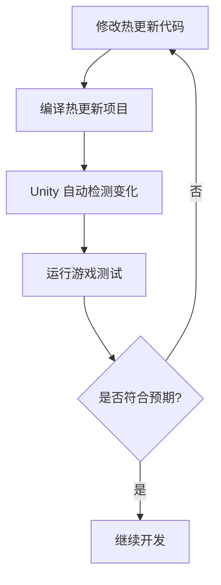

# 快速开始

本文将指导您如何开始使用 JEngine v1.0 进行热更新 Unity 游戏开发。

[[toc]]

## 环境要求

### Unity 版本要求
- **Unity 版本**：2021.3 LTS 或更高版本（推荐使用 2022.3 LTS）
- **API 兼容级别**：.NET Framework / .NET Standard 2.1

### 开发环境
- **.NET 版本**：.NET Framework 4.7.1+ 或 .NET 6.0+
- **开发系统**：Windows 10/11, macOS 10.15+, Ubuntu 18.04+
- **IDE 推荐**：Visual Studio 2022, JetBrains Rider, 或 Visual Studio Code

## 项目设置

### 1. 启用 Unsafe Code
在 Unity PlayerSettings 中找到 `Allow Unsafe Code` 并启用（勾选）。

### 2. 配置 .NET 版本
在 Unity PlayerSettings 中：
- 将 `API Compatibility Level` 设置为 `.NET Framework` 或 `.NET Standard 2.1`
- 确保不使用 `.NET Standard 2.0`

## 项目结构

JEngine v1.0 采用了优化的目录结构：

### Unity 工程结构
```
Assets/
├── Dependencies/           # 核心模块
│   ├── ILRuntime/         # ILRuntime 模块
│   ├── YooAsset/          # 资源管理模块
│   └── JEngine.Core/      # JEngine 核心
├── HotUpdateResources/    # 热更新资源
│   ├── Main/              # 主包资源
│   │   ├── Common/        # 通用资源
│   │   ├── Scenes/        # 场景资源
│   │   ├── Scripts/       # 热更新脚本 DLL
│   │   └── Shaders/       # 着色器资源
│   └── DLC/               # DLC 分包（可选）
├── Scripts/               # 本地脚本
│   ├── Helpers/           # 辅助类
│   ├── Adapters/          # ILRuntime 适配器
│   └── Examples/          # 示例代码
└── Scenes/
    └── Init.unity         # 启动场景
```

### 热更新代码结构
```
HotUpdateScripts/
├── Program.cs             # 程序入口点
├── JEngine/               # JEngine 框架代码
│   ├── Core/              # 核心功能
│   ├── Examples/          # 示例代码
│   └── UI/                # UI 系统
└── Game/                  # 您的游戏代码
    ├── Logic/             # 游戏逻辑
    ├── UI/                # 游戏界面
    └── Data/              # 数据模型
```

## 快速开始指南

### 步骤 1：获取 JEngine
1. 从 [GitHub Releases](https://github.com/JasonXuDeveloper/JEngine/releases) 下载最新的 v1.0 版本
2. 解压下载的文件

### 步骤 2：打开项目
1. 使用 Unity 打开 `UnityProject` 目录
2. 首次打开时会自动生成配置文件
3. 检查控制台是否有错误信息

### 步骤 3：配置热更新密码
1. 首次运行时会弹出密码设置对话框
2. 输入 16 位字符的加密密码（用于 DLL 加密）
3. 记住此密码，后续可在 JEngine 面板中修改

### 步骤 4：运行示例
1. 打开 `Init` 场景
2. 点击播放按钮运行游戏
3. 观察控制台输出，确认框架正常运行

### 步骤 5：开始热更新开发
1. 打开热更新代码项目：`UnityProject/HotUpdateScripts/`
2. 使用 IDE 打开 `.sln` 文件
3. 在 `Program.cs` 的 `RunGame` 方法中添加您的代码
4. 编译项目（Ctrl+Shift+B 或使用 IDE 的构建功能）

### 步骤 6：测试热更新
1. 修改热更新代码并编译
2. 返回 Unity 编辑器
3. 再次运行游戏，观察修改是否生效

## 开发流程

### 1. 代码开发流程


### 2. 资源开发流程
1. 将资源放入 `HotUpdateResources` 目录
2. 使用 JEngine 面板进行资源构建
3. 测试资源加载功能

## 常见问题

### Q: 编译热更新代码失败
**A:** 检查以下项：
- 确保 .NET 版本正确
- 检查代码语法错误
- 确认所有依赖项已正确引用

### Q: 热更新不生效
**A:** 可能的原因：
- 编译失败，检查编译输出
- DLL 文件未正确生成或复制
- 加密密码错误

### Q: Unity 控制台报错
**A:** 常见解决方案：
- 重新导入 JEngine 包
- 检查 Unity 版本兼容性
- 清理并重新构建项目

## 下一步

现在您已经成功设置了 JEngine v1.0 开发环境，可以：

1. 阅读核心概念了解框架原理（即将推出）
2. 查看资源管理学习资源系统（即将推出）
3. 探索示例项目获取实践经验（即将推出）
4. 参考 API 文档深入了解接口（即将推出）

---

**恭喜！您已经完成了 JEngine v1.0 的快速开始设置。开始构建您的热更新游戏吧！**